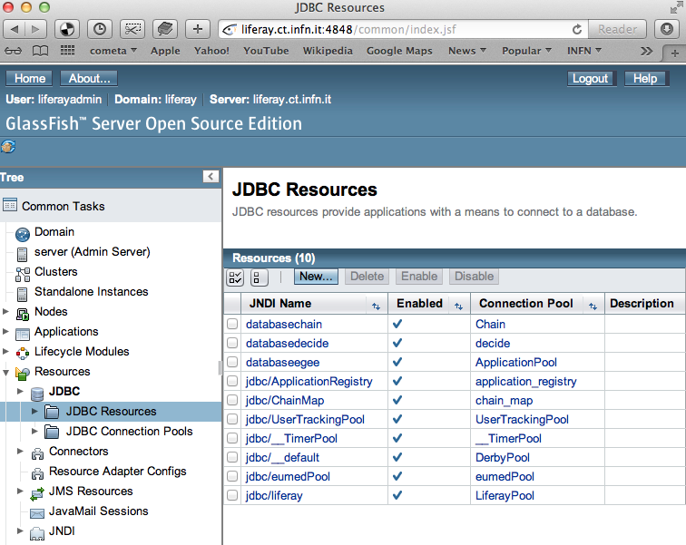
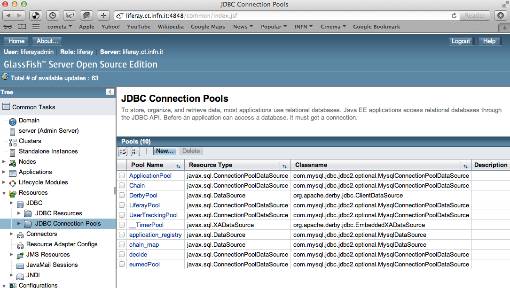
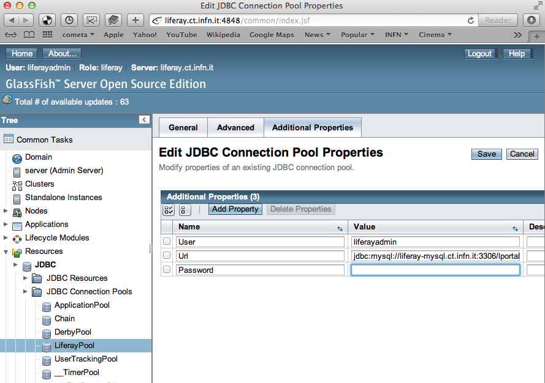
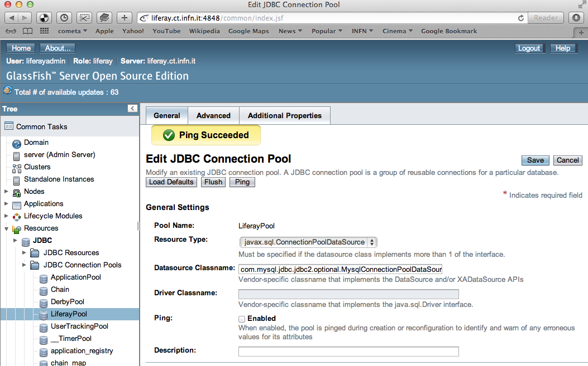

*******************************************
Installing Liferay 6.1.1 on Glassfish 3.1.x
*******************************************

================
Preliminar steps
================

----------------------
Server(s) requirements
----------------------

The Science Gateway and the database can be installed either on different machines or on the same one. As we chose the first approach, this is the one that is explained below. From now in on we will refer to these machines as: 

====================== ===============
Server Name            Value
====================== ===============
Scienge Gateway Server **sg-server**
Database Server        **sg-database**
====================== ===============

The next table shows physical configurations for both machines

+------------------------+------------------+----------------------------+------------+------------+
| Server Name            | Arch             | CPU                        | RAM        | Disk Space | 
+========================+==================+============================+============+============+      
| Scienge Gateway Server | x86_64 GNU/Linux | >= 4 cores (8 reccomended) | >= 8 gigas |  >= 1 TB   |
+------------------------+------------------+----------------------------+------------+------------+
| Database Server        | x86_64 GNU/Linux | >= 1 core                  | >= 1 giga  |  >= 20 GB  |
+------------------------+------------------+----------------------------+------------+------------+

The next table shows other configurations for machines. Of course you can choose the operative system you prefer, this is simply our choice. 

+-----------------------+------------------+-------------------------+-------------------------+
|Server Name            | Operative System | TERENA Host Certificate | Network Public Interface|
+=======================+==================+=========================+============+============+
|Scienge Gateway Server | CentOs 6.2       | Yes, CoMoDo             | Yes                     |
+-----------------------+------------------+-------------------------+-------------------------+
|Database Server        | Debian 6.0.3     | No                      | No                      |
+-----------------------+------------------+-------------------------+-------------------------+

Verify that your machine has direct and reverse address resolution (check your DNS configuration). Use host command to verify everything works properly: 

.. code:: bash

	host sg-server.yourdomain.foo
	sg-server.yourdomain.foo has address 10.0.0.1
	
	host 10.0.0.1
	Host 1.0.0.10.in-addr.arpa domain name pointer sg-server.yourdomain.foo

The full list of the hardware server requirements can be downloaded from :download:`here <figures-and-documents/Catania_SG_service_list.pdf>`

---------------------
Software requirements
---------------------

You must be **root** on the machine to perform next steps.

Let's add some repo files to the existing ones in order to install the required software. Add these three repo files to your system: 

* `CentOS-Shibboleth.repo <https://raw.githubusercontent.com/csgf/csgf/master/installation-configuration/docs/figures-and-documents/CentOS-Shibboleth.repo>`_

* `EGI-trustanchors.repo <https://raw.githubusercontent.com/csgf/csgf/master/installation-configuration/docs/figures-and-documents/EGI-trustanchors.repo>`_

* `EUGRIDPMA-fetch-crl3.repo <https://raw.githubusercontent.com/csgf/csgf/master/installation-configuration/docs/figures-and-documents/EUGRIDPMA-fetch-crl3.repo>`_ 

You can use wget command to download the three files into: 

.. code:: bash

	/etc/yum.repos.d 

Now you can install the following software: 

.. code-block:: bash

	yum clean all
	yum update
	yum install shibboleth httpd lcg-CA java-1.7.0-openjdk-devel.x86_64 \
	fontpackages-tools mysql.x86_64 mod_ssl.x86_64 \
	php.x86_64 vim-enhanced.x86_64 fetch-crl

--------------------
Apache Configuration
--------------------

To allow the Science Gateway to accept connections on port 80, you need to configure and start Apache. At these steps you need to specify the certificate file for the machine for SSL connection. This certificate file should be supplied from your CA authority.

Edit apache configuration files (you must be **root** to perform the next steps) 

Download into

.. code:: bash

	/etc/httpd/conf.d/

The following files: 

* `Proxy ajp configuration file <https://raw.githubusercontent.com/csgf/csgf/master/installation-configuration/docs/figures-and-documents/proxy_ajp.conf>`_

* `Virtual host configuration file <https://raw.githubusercontent.com/csgf/csgf/master/installation-configuration/docs/figures-and-documents/virtualhost.conf>`_ 

Edit the configuration file: 

.. code:: bash

	vim /etc/httpd/conf.d/virtualhost.conf
	...
	ServerAdmin sg-serveradminlist@yourdomain.foo
	ServerName sg-server.yourdomain.foo

Edit the configuration file:

.. code:: bash

	vim /etc/httpd/conf/httpd.conf

If you find a line like the following: 

.. code:: bash

	LoadModule proxy_ajp_module modules/mod_proxy_ajp.so

comment it. 

Make sure that 

.. code:: bash

	KeepAlive is Off

After this editing start the server:

.. code:: bash

	/etc/init.d/httpd start 
	
or

.. code:: bash

	service httpd start

configure apache to start at boot

.. code:: bash

	chkconfig --level 2345 httpd on

------------------------
Create liferayadmin user
------------------------

It is important to install liferay and its application server (i.e. glassfish) as a **normal** user and not root. For this reason, before continuing with the installation, create a specific user and use it to execute the next commands: 

.. code:: bash

	adduser liferayadmin
	su - liferayadmin

======================
Glassfish Installation
======================

Download `Glassfish <http://glassfish.java.net/>`_ source files. The version we currently in use in our production server is `GlassFish Server Open Source Edition 3.1 (build 43) <http://download.java.net/glassfish/3.1/release/glassfish-3.1.zip>`_. Otherwise the release supported by liferay 6.1.1 is `GlassFish Server Open Source Edition 3.1.2.2 (build 5) <http://download.java.net/glassfish/3.1.2.2/release/glassfish-3.1.2.2.zip>`_. Unpack the zip archive in:

.. code:: bash

	/opt/

You may have to use *chown* and *chgrp* to change the directory permissions to the normal user. e.g. "chown -R liferayadmin /opt/glassfish3/".

When you create a domain for liferay in glassfish, you will be asked for a username and password. This is the admin user for your application server.  

.. code:: bash
 
	[liferayadmin@sg-server ~]$ cd /opt/glassfish3/bin/
	[liferayadmin@sg-server bin]$ sh asadmin create-domain liferay
	Enter admin user name [Enter to accept default "admin" / no password]> liferayadmin
	Enter the admin password [Enter to accept default of no password]> 
	Enter the admin password again> 
	Using port 4848 for Admin.
	Using default port 8080 for HTTP Instance.
	Using default port 7676 for JMS.
	Using default port 3700 for IIOP.
	Using default port 8181 for HTTP_SSL.
	Using default port 3820 for IIOP_SSL.
	Using default port 3920 for IIOP_MUTUALAUTH.
	Using default port 8686 for JMX_ADMIN.
	Using default port 6666 for OSGI_SHELL.
	Using default port 9009 for JAVA_DEBUGGER.
	Distinguished Name of the self-signed X.509 Server Certificate is:
	[CN=oldliferay2,OU=GlassFish,O=Oracle Corporation,L=Santa Clara,ST=California,C=US]
	Distinguished Name of the self-signed X.509 Server Certificate is:
	[CN=oldliferay2-instance,OU=GlassFish,O=Oracle Corporation,L=Santa Clara,ST=Calif...
	No domain initializers found, bypassing customization step
	Domain test created.
	Domain test admin port is 4848.
	Domain test allows admin login as user "liferayadmin" with no password.
	Command create-domain executed successfully.

Remember to edit the firewall rules using iptables to open the correct ports (4848, 8080). 

Edit the configuration file in other to increase the size of the virtual machine used by glassfish (search the secion of jvm-options). This can also be done through the glassfish administration interface.

.. code:: bash

	vim /opt/glassfish3/glassfish/domains/liferay/config/domain.xml 

.. code:: xml 	

	<jvm-options>-server</jvm-options> <!-- change this, the original value is -client -->
	<jvm-options>-XX:MaxPermSize=512m</jvm-options>
	<jvm-options>-Xms4096m</jvm-options>
	<jvm-options>-Xmx4096m</jvm-options>
	<jvm-options>-XX:MaxNewSize=700m</jvm-options>
	<jvm-options>-XX:NewSize=700m</jvm-options>
	<jvm-options>-XX:SurvivorRatio=10</jvm-options>
	<jvm-options>-Dfile.encoding=UTF8</jvm-options> 
	<jvm-options>-Djava.net.preferIPv4Stack=true</jvm-options> 
	<jvm-options>
	   -Dorg.apache.catalina.loader.WebappClassLoader.ENABLE_CLEAR_REFERENCES=false
	</jvm-options>
	<jvm-options>-Duser.timezone=GMT</jvm-options>

------------------------------------------
Configure glassfish to access the database
------------------------------------------

Liferay needs a database to run. Instead of accessing it directly, Liferay can use a Connection Pool defined in Glassfish to open a connection to the database server. Running the following command the connections will be created. 

Before initiating the command, you need to start the glassfish instance:

.. code:: bash

	[liferayadmin@sg-server ~]$ sh /opt/glassfish3/bin/asadmin start-domain liferay
	Waiting for liferay to start .....................................
	Successfully started the domain : liferay
	domain  Location: /opt/glassfish3/glassfish/domains/liferay
	Log File: /opt/glassfish3/glassfish/domains/liferay/logs/server.log
	Admin Port: 4848
	Command start-domain executed successfully.

Now you can run the command:

.. code:: bash

	[liferayadmin@sg-server ~]$ sh /opt/glassfish3/bin/asadmin \
	-u liferayadmin create-jdbc-connection-pool \
	--datasourceclassname com.mysql.jdbc.jdbc2.optional.MysqlConnectionPoolDataSource \
	--restype javax.sql.ConnectionPoolDataSource \
	--property \
	"user=liferayadmin:password=liferayadminMySqlPasswrod:\
	url='jdbc:mysql://sg-database:3306/lportal'" LiferayPool 
	
	[liferayadmin@sg-server ~]$ sh /opt/glassfish3/bin/asadmin -u liferayadmin create-jdbc-resource \
	--connectionpoolid LiferayPool jdbc/liferay 

In this way, we are setting a connection pool able to connect to a machine with the hostname **sg-database** using the default port **3306** for the database. In the database there is a table called **lportal** that can be read/write by a user named **liferayadmin** identified by the password **liferayadminMySqlPasswrod**. From now in on we will be able to refer to this resource thanks to the name we assigned: **jdbc/liferay**. In order to configure the database properly, please refer to the [guide](https://sourceforge.net/p/ctsciencegtwys/wiki/ConfigLportalInMySQL/).

**Create a proxy ajp listener**

In order to bind glassfish with apache, you must create a proxy ajp listener.  After the connector is created, you need to stop the server.  

.. code:: bash

	[liferayadmin@sg-server ~]$ sh /opt/glassfish3/bin/asadmin create-network-listener \
	--listenerport 8009 --protocol http-listener-1 --jkenabled true apache
	Command create-network-listener executed successfully.

Now stop the server:

.. code:: bash

	[liferayadmin@sg-server ~]$ sh /opt/glassfish3/bin/asadmin stop-domain liferay
	Waiting for the domain to stop ..............
	Command stop-domain executed successfully.

--------------------
Liferay Installation
--------------------

Liferay is a web application, and so we need to deploy it on Glassfish. Before the deployment, we need to provide the correct library in Glassfish. 

**Liferay files**

Considering Liferay needs to use a MySQL database, a driver is needed. Copy the mysql connector in the path:

.. code:: bash

	[liferayadmin@sg-server ~]$ /opt/glassfish3/glassfish/domains/liferay/lib/

You can download the java connector for your version of mysql server from the `official site <http://dev.mysql.com/downloads/connector/j/>`_ or download `ours <http://sourceforge.net/projects/ctsciencegtwys/files/wiki/mysql-connector-java-5.1.13.jar/download>`_.

Now you can copy liferay's jar. Liferay refers to these file as liferay portal dependencies. `Form here <https://sourceforge.net/projects/lportal/files/>`_ you can find the full list of liferay files. There are different dependencies corresponding to the different liferay version. To install *Liferay 6.1.1 CE GA2* download dependencies from `this link <http://sourceforge.net/projects/lportal/files/Liferay%20Portal/6.1.1%20GA2/liferay-portal-dependencies-6.1.1-ce-ga2-20120731132656558.zip>`. After downloading, extract the archive and copy the jar file into the same path of mysql java connector (see the example below): 

.. code:: bash

    [liferayadmin@sg-server ~]$cp liferay-portal-dependencies-6.1.1-ce-ga2/*.jar \
    /opt/glassfish3/glassfish/domains/liferay/lib
    [liferayadmin@sg-server ~]$ tree /opt/glassfish3/glassfish/domains/liferay/lib
    /opt/glassfish3/glassfish/domains/liferay/lib
    ├── applibs
    ├── classes
    ├── databases
    ├── ext
    ├── hsql.jar
    ├── mysql-connector-java-5.1.35-bin.jar
    ├── portal-service.jar
    └── portlet.jar
    

**Liferay deploy**

A web application is identified by an archive with extension .war. Download the liferay portal .war from `the Liferay sourceforge repository <http://sourceforge.net/projects/lportal/files/Liferay%20Portal/6.1.1%20GA2/liferay-portal-6.1.1-ce-ga2-20120731132656558.war>`_

Start glassfish in order to deploy the .war: 

.. code:: bash
 
	[liferayadmin@sg-server ~]$ sh /opt/glassfish3/bin/asadmin start-domain liferay

Once you get back the prompt, you can deploy the .war file with the command (supposing you downloaded it into the liferayadmin home)

.. code:: bash

	[liferayadmin@sg-server ~]$ sh /opt/glassfish3/bin/asadmin -u liferayadmin deploy \
	--contextroot / --verify=true \
	--name liferay611cega2 /home/liferayadmin/liferay-portal-6.1.1-ce-ga2-20120731132656558.war

You will be asked for the glassfish admin user password. To check the status of the deploy you can refer to the glassfish log file.  

.. code:: bash

	[liferayadmin@sg-server ~]$ tail -f /opt/glassfish3/glassfish/domains/liferay/logs/server.log

You can also type 

.. code:: bash

	[liferayadmin@sg-server ~]$ sh /opt/glassfish3/bin/asadmin list-domains

Once the deployment is finished we can stop the server to customise the liferay installation:

.. code:: bash

	[liferayadmin@sg-server ~]$  sh /opt/glassfish3/bin/asadmin stop-domain liferay

If the deployment has been completed successfully you will find the liferay files in: 

.. code:: bash

	/opt/glassfish3/glassfish/domains/liferay/applications/liferay611cega2

Edit the liferay portal properties file to connect it to the database: 

.. code:: bash

    [liferayadmin@sg-server ~]$ vim /opt/glassfish3/glassfish/domains/liferay/applications/\
    liferay611cega2/WEB-INF/classes/portal-ext.properties
	
	jdbc.default.jndi.name=jdbc/liferay
	
	web.server.http.port=80
	web.server.https.port=443
	
	# Parameter in other to avoid Lifery to append sessionID to link
	session.enable.url.with.session.id=false
	
	# In order not to show portlet that can't be visualized by the user
	layout.show.portlet.access.denied=false
	
	# Set this to true to convert the tracked paths to friendly URLs.
	#session.tracker.persistence.enabled=true
	#session.tracker.friendly.paths.enabled=true
	#
	# Set this to true to enable the ability to compile tags from the URL.
	# Disabling it can speed up performance.
	#
	tags.compiler.enabled=false
	
	#
	# Disable locale in friendly url
	#
	locale.prepend.friendly.url.style=0
	
	# Configure email notification settings.
	admin.email.from.name=Liferay Administrator Name 
	admin.email.from.address=LiferayAdministratorMail@yourdomain
	
	## Live Users
	## Set this to true to enable tracking via Live Users.
	live.users.enabled=false
	
	session.tracker.persistence.enabled=true

Now you can start glassfish again: 

.. code:: bash 

    [liferayadmin@sg-server ~]$ sh /opt/glassfish3/bin/asadmin start-domain liferay

If everything is ok you should find the default liferay instance at: 

http://sg-server:8080

------------------
Post Installations
------------------

**Make glassfish domain start at boot**

Edit the rc.local file in order to make glassfish start in case the server reboots:

.. code:: bash

	[root@sg-server ~]# vim /etc/rc.local 
	...
	su -c "sh /opt/glassfish3/glassfish/bin/asadmin start-domain liferay" - liferayadmin

Where you specify that the user **liferayadmin** (and not root) will start the process automatically at boot.

**Install Marketplace Portlet**

Download the `Marketplace portlet <http://sourceforge.net/projects/lportal/files/Liferay%20Plugins/6.1.2%20GA3/marketplace-portlet-6.1.2.4.war>`_ and deploy on the portal using the following command:

.. code:: bash

	[liferayadmin@sg-server ~]$ cp marketplace-portlet-6.1.2.4.war /opt/glassfish3/deploy/

Check the log file to see if the portlet is correctly deployed, yoiuu should see some line like the following in the server.log file:

.. code:: bash

    ...
    [AutoDeploy] Successfully autodeployed : /opt/glassfish3/glassfish/domains/liferay/autodeploy/marketplace-portlet.|#]
    ...

In order to use the Marketplace portlet you need to create your own account, please create a new one, if you don't already have it. Then open your portal installation, select *Go to -> Control Panel* from the top right corner and Stro from the left menu. Fill the fields with your Liferay creditials, look for *Web form* and select the free Web Form CE portlet, click on *Purchase* button (this just make availaible this portlet for your Liferay account). Now from the left sied menu select *Purchased* and click the Install button on the Web Form portlet, waits until the installation process ends.

---------------
Troubleshooting
---------------

**Glassfish Port**

If your network is not configured properly you could not be able to start glassfish and you will get this error: 

.. code:: bash

	There is a process already using the admin port 4848 -- it probably is another instance of a GlassFish server.
	Command start-domain failed.

If you are sure there is no process using that port (use *nmap -sT -O localhost* or a variation), check that the address configured for your machine is correct and that it corresponds to the correct hostname configured. 

As a good rule, you should set them in the /etc/hosts files as below:

.. code:: bash

	[root@sg-server ~]# vim /etc/hosts
	...
	10.0.0.1   sg-server.yourdomain.foo    sg-server

**Glassfish Connection Pools**

It is important to configure the connection pools properly. If you don't, Liferay will not be able to start, or it's possible it will still use the database on file, that should not be used on a production server.

Glassfish has a web interface. Access it and check if the connection to the database works properly. To access glassfish:

http://sg-server:4848

and fill with username liferayadmin and the password you set for the glassfish administrator.

Navigating on the left tree you can check the resources you created during the configuration process. Check the list of the JDBC Resources: 

.. _Figure 1:

   
   JDBC Resources
   
JDBC Connection Pools:
   
.. _Figure 2:

   
   JDBC Connection Pools

Check the additional properties for Liferay Pool:

.. _Figure 3:

   
   Liferay Pool additional properties

In case all the parameters are set correctly try to ping the database:

.. _Figure 4:

   
   Liferay Pool Ping test

**Liferay Theme not loaded properly** 

If the start page is not loaded properly, before or after the configuration wizard, there could be some files created by liferay directory that have the wrong write permissions. 

As root check the /tmp directory: 

.. code:: bash

	[root@sg-server ~]# cd /tmp/
	[root@sg-server tmp]# ls -l
	total 16
	drwxr-xr-x  2 liferayadmin liferayadmin 4096 Mar  4 18:46 hsperfdata_liferay
	drwxr-xr-x. 3 root    root    4096 Mar  4 18:48 liferay
	drwxr-xr-x. 2 liferayadmin liferayadmin 4096 Feb 28 17:40 xuggle

and if you have a content like the one above change the owner of the liferay directory: 

.. code:: bash

	[root@science-gateway tmp]# chown -R liferayadmin.liferayadmin liferay/
	[root@science-gateway tmp]# ls -l
	total 16
	drwxr-xr-x  2 liferayadmin liferayadmin 4096 Mar  4 18:46 hsperfdata_liferay
	drwxr-xr-x. 3 liferayadmin liferayadmin 4096 Mar  4 18:48 liferay
	drwxr-xr-x. 2 liferayadmin liferayadmin 4096 Feb 28 17:40 xuggle

**Maximum Number of file**

Check what is the maximum number of file the operative system can open:

.. code:: bash

	[liferayadmin@sg-server ~]$ cat /proc/sys/fs/file-max 
	1610813

In case the number is too low set an higher value in the variable:

.. code:: bash

	vim /etc/sysctl.conf
	# Controls the maximum number of opened files 
	fs.file-max=2000000

**SELinux**

In case you are not able to start apache server properly you should check you SELinux configurations.

To view your SELinux status type 

.. code:: bash

	[liferayadmin@sg-server ~]$ getenforce 
	Enforcing

In this case SELinux is enabled. You should edit its policy in order to allow apache and shibboleth work properly. Otherwise you have to disable it. 

To temporary disable it, as root, run: 

.. code:: bash

	[root@sg-server ~]# setenforce 0

In case you want to permanent disable it, you need to edit this file and reboot (always as root): 

.. code:: bash

	vim /etc/selinux/config
	....
	SELINUX=disables
