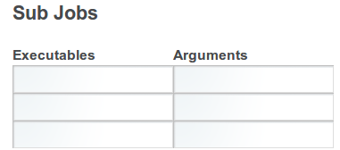
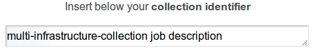
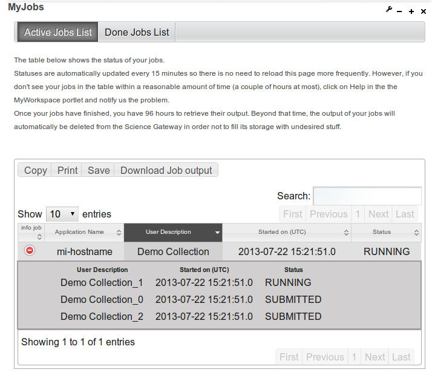
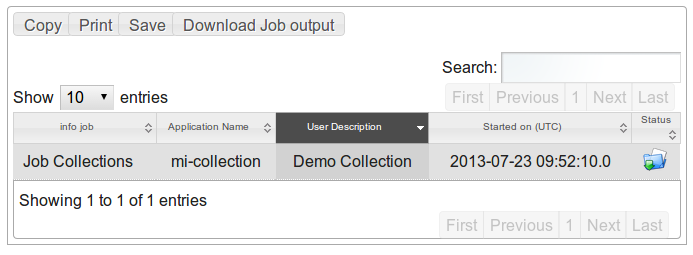

*****************
CollectionPortlet
*****************

This page contains what you need to develop your own portlet to submit and run special jobs.

You can choose the kind of parallel job you would like to run from a list containing the following elements:

Job Collection: is a simple parallel application that spawns N sub-jobs; when all these are successfully  completed the whole collection becomes DONE.
Workflow N1: is a parallel application that spawns N sub-jobs, waits until all these are correcly completed and then submits a new job whose input files are the outputs of the N sub-jobs. When also this "final job" is successfully executed, the whole Workflow N1 becomes DONE.
Job Parametric: is a parallel application that spawns N sub-jobs with the same executable and with different arguments (i.e., input parametrers); when all these are successfully completed the whole parametric job becomes DONE.
The following instructions show how to deploy this exemplar portlet, how to use it to submit the above mentioned parallel jobs and how to customize the code to reuse it to develop your own portlets.

Deploy mi-parallel-app-portlet

This section explains how to deploy mi-hostname-collection-portlet that allows you to submit and run a special parallel job on a Distributed Computng infrastructure.

**Steps to deploy the portlet:**

First of all, make sure that your Liferay server is correctly up and running, then:

- Move to your Liferay plugin SDK portlets folder and get the mi-hostname-collection-portlet through svn command:

   svn checkout svn://svn.code.sf.net/p/ctsciencegtwys/liferay/trunk/gilda/mi-parallel-app-portlet mi-parallel-app-portlet
 
- Now, move into the just created mi-parallel-app-potlet directory and execute the deploy command:

   ant deploy

   When previous the command has completed, verify that if the portlet is "Successfully autodeployed" you can see this in your Liferay log file.
 
- Then, open your browser at http://localhost:8080 click Add > More in the GILDA menu, click on Add button to add this new portlet. following picture shows the correctly result:

.. image:: figures-and-documents/figure8.png

**Now you should be able to submit your first parallel job on a distributed Grid infrastructure**, insert an example text and add a brief example description, then click on the "Submit" button.

To check the job status and to retrieve the output when the collection will be DONE, you should use the MyJob portlet, if you haven't already installed MyJob portlet you can find instruction to install it here.

**Perform a parallel application**

- Select the collection type from the ComboBox:
.. image:: figures-and-documents/figure9.png

- Insert the number of tasks that compose this collection:
.. image:: figures-and-documents/figure10.png

- Clickin on the "OK" button, the page will be automatically updated with a number of input text fields equal to the number of tasks entered, fill these input text fields with some command, like hostname, ls, echo, etc. Optionally, you can also specify argments for that commands into the relatives text fileds.

The picture is showing the result if you insert 3 into the above mentioned task number field.

- Now, insert a collection identifier

- Finally, click on the Submit button to execute this collection.
Now move to the MyJob portlet and if all went well, this is the result that you should see:

When all sub-jobs belonging to job collection have successfully completed you can download the whole job collection output.

Alternatively, you could click on the Demo button that fills input fields with demo values:

task number equal to 3;
the following executables:
hostname
ls
pwd

If you select Workflow N1 the executables demo values are the same as previously seen while the final job executable is a "ls" command. Else, if you select Job Parametric the only executable is the "echo" command; in this case the arguments are mandatory and the demo values inserted consist of a string with job index appended.

**Customize mi-parallel-app-portlet**

This section describes the steps to create a new portlet from the template provided by the mi-parallel-app-portlet.

- Move into Liferay plugin SDK portlets folder;
 
- Copy mi-parallel-app-portlet folder to <your_portlet_name>-portlet 

cp -R mi-parallel-app-portlet <your_portlet_name>-portlet
 
- Move into <your_portlet_name>-portlet folder;
 
- Edit the customize.sh file, set the following parameters as you prefer:
AUTH_EMAIL=<your@email>
 
AUTH_NAME='<your name>'
 
AUTH_INSTITUTE='<your_institute>'
 
Attention: the APP_NAME value must be set with the name that you assigned in your portlet folder name:
APP_NAME=<your_potlet_name>
 
- Run customize.sh script, with

./customize.sh
 
- Then deploy the portlet with the ant deploy command (and check the Liferay log file).

When the deploy process has completed you can add the new portlet by opening your browser at http://localhost:8080, clicking Add > More in the GILDA menu, and the clicking on Add button.

