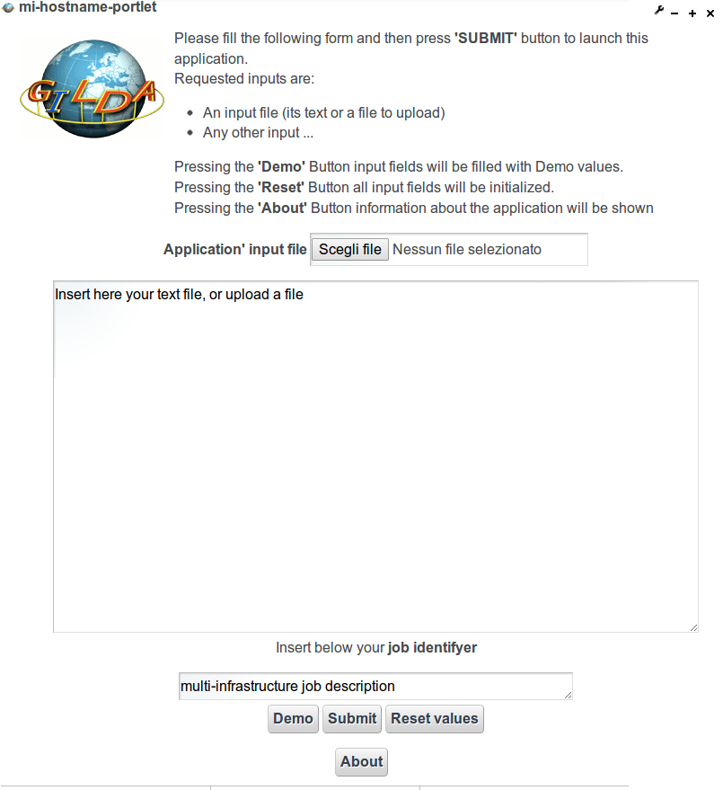
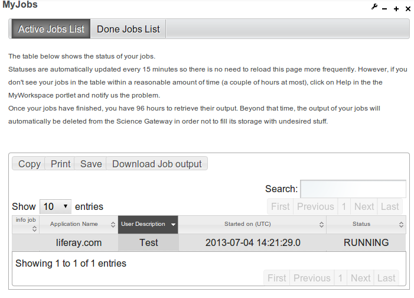

****************************************
Creation of a portlet that submits a job
****************************************

This page shows a complete example of portlet code contains anything you need to develop your own portlet to submit and run a sequential application.

Following instructions provide a step by step guide explaining how to just deploy a portlet that submit and run a sequential Grid applications in a distributed Grid infrastructure. Then shows the steps that developers can follow to customize the template in order to obtain in the fastest possible way a full featured web application able to submit jobs in a distributed Grid infrastructure.

To correctly execute following steps, you must have successfully completed the "To correctly execute the following steps, you must have successfully completed the "Installation and configuration of the development environment" tutorial.

It is also highly recommended that you have followed the previous tutorial in how to create your first parameterized portlet, in order to understand the portlet workflow.

**Deploy mi-hostname-portlet**

This section explains how to deploy mi-hostname-portlet that allows you to submit and run a sequential Grid applications in a distributed Grid infrastructure.

**Steps to deploy the portlet:**

First of all make sure that your liferay is correctly up and running, then:

- Move to your Liferay plugin SDK portlets folder and get the mi-hostname-portlet through svn command:

svn checkout svn://svn.code.sf.net/p/ctsciencegtwys/liferay/trunk/gilda/mi-hostname-portlet mi-hostname-portlet

- Now move into the just created mi-hostname-potlet directory and execute the deploy command:

ant deploy

When previous command has completed, verify that if the portlet is "Successfully autodeployed" you can see this in your Liferay log file.

- Then open your browser at http://localhost:8080 click Add > More you should have the new GILDA menu, click on it and then Add this new portlet. following picture shows the correct result:

*Now you should be able to submit your first sequential job on a distributed Grid infrastructure*, insert an example text into the shown text are and a brief example description, then click  on "Submit"  button.
 
**Install MyJob portlet**

To check the job status and to retrieve the output when job is done, you should install our MyJob portlet, in order to do this you have to make some configuration in your liferay environment. 

- Open the Glassfish Administration Console (http://localhost:4848).

- Create a new JDBC connection pool for MyJob portlet:
   
	* On the left menu select Resources > JDBC > JDBC Connection Pools
   
	* Click New... to create a new pool with the following settings:

		** Pool Name: usertrackingPool
   	
		** ResourceType: javax.sql.DataSource
 	
		** Database Driver Vendor: select MySql
  
	* Click Next and left the default parameters;
   
	* Select and remove all the properties from the "Additional Properties" table (buttom page);

	* Click on "Add" and create the following three properties:

		Name: Url, Value: jdbc:mysql://localhost:3306/userstracking
		
		Name: User, Value: tracking_user

		Name: Password, Value: usertracking

	* Click on "Finish" button to save configuration.

- Click on the 'Ping' button to test the connection pool. If everything is working fine the "Ping Succeded" message should appear on top.

- Create a new JDBC Resource:

	* On the left menu select Resources > JDBC > JDBC Resources

	* Click New... to create a new JDBC Resource with the following settings:

		** JNDI Name: jdbc/UserTrackingPool

		** Pool Name: select usertrackingPool
	
	* Click on "Finish" button to save configuration.

- Restart Glassfish

When restart procedure has completed you can proceed with the installation of the MyJob portlet.

- Downlod MyJob.war

- Move the downloaded WAR file in the deploy folder under your Liferay bundle installation, see Liferay log until deploy process complete successfully ("Successfully autodeployed")

- Open your browser at http://localhost:8080 click Add > More > INFN > MyJob > Add

Now you should see the status of the job that you have submitted previously, see picture below

When Status column from RUNNING becomes  you can download the job output by clicking on this icon  .. image:: figures-and-documents/figure15.png

*Customize mi-hostname-portlet*

This section describes the steps to create a new portlet from the template provided by mi-hostname-portlet.

- Move into Liferay plugin SDK portlets folder

- Copy mi-hostname-portlet folder in <your_portlet_name>-portlet cp -R mi-hostname-portlet <your_portlet_name>-portlet

- Move into <your_portlet_name>-portlet folder

- Edit the customize.sh file, set the following parameters as you prefer:

  AUTH_EMAIL=<your@email>
  
  AUTH_NAME='<your name>'
  
  AUTH_INSTITUE='<your_institute>'
  
Pay attention: the APP_NAME value must be set with the name that you assigned in your portlet folder name

    APP_NAME=<your_potlet_name>

- Run customize.sh script, with ./customize.sh

- Then deploy portlet with ant deploy (see Liferay log file).
