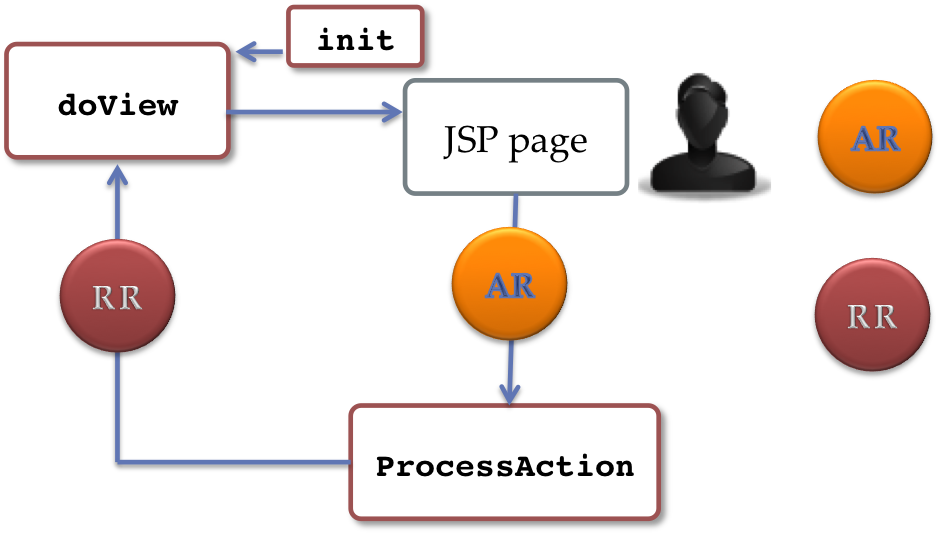

******************************************
Creation of a simple parameterised portlet
******************************************

This complete example of portlet code contains anything you need to develop your own first portlet . For this reason developers can use it as a template source code to customize according to their own specific requirements.
Following instructions provide a step by step guide explaining how to customize the template in order to obtain in the fastest possible way a full featured web application.

**Portlet Workflow**

Before to start with the portlet template it is important to understand the internal &nbsp;workflow of a standard portlet (JSR168/286). The picture below well depicts the entire workflow among the different portlet components. Components in the figure are simply class methods of the GenericPortlet Java class provided by the portlet SDK.

.. image:: figures-and-documents/figure1.png
   :align: left

::

	Class GenericPortlets{
	init(PortletConfig);
	processAction(ActionRequest, ActionResponse);
	render (RenderRequest, RenderResponse);
	destroy();
	**doView**(Request, Response);
	**doEdit**(Request, Response);
	**doHelp**(Request, Response);
	}

- The above figure depicts the whole lifecycle of a portlet; the most important loop foresees the exchange between the **ProcessAction** and **Render** methods, respectively responsible of the action selected by the user in the input forms and then the interface to show back to the user as consequence of the user action.

**Portlet Modes**
		
Standard portlets opreate in 3 different modes: **VIEW**, **EDIT**, **HELP**

* **VIEW**: generates the normal user interface
* **EDIT**: used to store portlet preferences
* **HELP**: show usage instruction

The **Render** method is responsible to call a different **GenericPortlet** class method accordingly to the current portlet mode as shown in the figure:

.. image:: figures-and-documents/figure2.png
   :align: left	
          	

**Render** method will call then **GenericPortlet**methods: **doView**, **doHelp**, **doEdit**
Each method is responsible to present the appropriate user interface accordingly to the user action and portlet status.

**Data Exchange between Java and JSP pages**

During the user interaction there is a continuous data exchange between the **GenericPortlet** class and the **JSP** pages responsible of the user interface presentation. Following paragraphs show how exchange data between jps pages and the Java code.
			
**JSP -> Java**

Inside the JSP code place all JAVA' input fields into a web form:

::

    <form action="<portlet:actionURL portletMode="view"> 
    <portlet:param name="param_name_1" value="paramvalue 1" />
    ... 
    <portlet:param name="param_name_n" value="paramvalue n"/> 
    ...
    <input … />
    <input … />

    <input type="submit" … />
    </form>

Inside the JAVA code get the input interface values with:

::

    doView/doHelp/doEdit(RenderRequest  request,…
    // To obtain the parameter just set …
    String param_i= request.getParameter("param_name_i");

**Java -> JSP**

Inside the JAVA code get the input interface values with:

::
    
    doView/doHelp/doEdit(RenderRequest  request,…
    // To obtain the parameter just set …
    String param_i= request.setAttribute("param_name_i","param_value_i");

Inside the JSP page load parameter values with:

::
    
    <%
     // To load variables from PortletClass …
    %>
    <jsp:useBean id="param_name_k" class="<variable type k>" scope="request"/>
    
    <%
    // To reference a paramvalue
    %>

Reference paramenter_name' value with: <%=param_name_k%>

**GenericPortlet main workflow**
		
	The following picture shows the internal workflow inside the GenericPortlet class while the user interacts with the WebApplication:

			
		.. image:: figures-and-documents/figure3.png
  		   :align: left	

The loop starts with the **Init()** method then the entire workflow plays around the methods **ProcessAction** and **doView** (assuming the VIEW mode).
For each User Action a different View will be selected

During this loop two important object instances are used to exchange data between the **doView** and **processAction** methods as shown below:
			

**actionRequest** input of processAction method which prepares the render object for view methods
**renderRequest** input of View methods: **doView**/**doHelp**/**doEdit**
		

**Deploy myFirstPortlet**

In this section we can see how the steps that you have to follow to deploy the **myFirst-portlet** in your liferay bundle installation.

1. Move in your Liferay plugin SDK potlets folder

::
    
    cd $LIFERAY_SDK_HOME/portlets/

2. Download myFirst-portlet source code through svn command:

::
   
    svn checkout svn://svn.code.sf.net/p/ctsciencegtwys/liferay/trunk/gilda/myFirst-portlet

3. Move into myFirst-portlet/ folder

4. Deploy portlet with the following command (and see LIferay log):

::
   
   ant deploy

If built process complet successfully , you can see in Liferay Log somethins like this:

::

    Successfully autodeployed : LIFERAY_HOME/glassfish-3.1.2/domains/domain1/autodeploy/myFirst-portlet.|#

5. Open web browser at `http://localhost:8080 <http://localhost:8080>`_, click on Add > More > CataniaSG > myFirst-portlet.
		
.. image:: figures-and-documents/figure5.png
   :align: left

**Customize myFirstPortlet**

This section describes the steps to create a new portlet from the template provided by myFirst-portlet.

- Move into Liferay plugin SDK portlets folder

- Copy myFirst-portlet folder in your_portlet_name-portlet 

::

	cp -R myFirst-portlet your_portlet_name-portlet

- Move into your_portlet_name-portlet folder

- Edit the customize.sh file, set the following parameters as you prefer:

	-- AUTH_EMAIL= your@email
	-- AUTH_NAME= your name
	-- AUTH_INSTITUE= your_institute

Pay attention: the APP_NAME value must be set with the name that you assigned in your portlet folder name

- APP_NAME=&lt;your_potlet_name

- Run customize.sh script, with 

::

	./customize.sh

- Then delpoy portlet with ant deploy
		
			
To see the result follow step 5 in previous section changing "myFirst-portlet" with "your_potlet_name-portlet"

		
**Web application editors**

This is the right moment to create a project using a high level web application editor like NetBeans or Eclipse.
Following instructions are valid for **NetBeans**

- Download Netbeans IDE

- Open **New Project** > Java Web > Web Application with **Existing Sources** and press **'Next'**;

- In Location browse the "your_potlet_name"-portlet directory and press 'Next';

- Accept any suggestion and proceed and press 'Next';

- Add other directory places;
				
	WEB-INF Content: Select the docroot/WEB-INF directory inside the your_potlet_name-portlet directory;

- Then press the 'Finish' button and the project will be created

* Right click on the project name and click on Peferences, then Libraries.

* Select all jars pointed by 

::

	$LIFERAY_HOME/glassfish-3.1.2/domains/domain1/lib

(in your liferay bundle)

Following instructions are valid for **Eclipse**

- Download Eclipse IDE for java EE Developers;

- Set the Eclipse Workspace to the "portlets" $LIFERAY_SDK_HOME/portlets/ directory;

- Select File > New >  Web > Dynamic Web Porject  and press 'Next'

Fill the Web Dynamic Web Project Wizard with 
						
- the project name: your_potlet_name-portlet;

- the default location only if the default one is not correct;>

- the glassfish target runtime (if doesn't exist create a new one with the New Runtime... wizard);

- leave the default values for Dynamic Web module_vesion and Configuration fields and press 'Next';

- Change the Content Directory to "docroot";

- Change the Java Source Directory to "docroot/WEB-INF/src" and press 'Finish';

- In order to fix some library dependencies could be necessary add external Jars.
	Right click on the project name and click on "Properties" > Java Build Path >  Libraries  and select all jars pointed by $LIFERAY_HOME/glassfish-3.1.2/domains/domain1/lib (in your liferay bundle)

Start to develop the interface modifying jsp files and change java code enums with correct Actions and Views modese with the proper identifiers. For simple user interfaces there will be no need to add other jsp or action/view modes.

