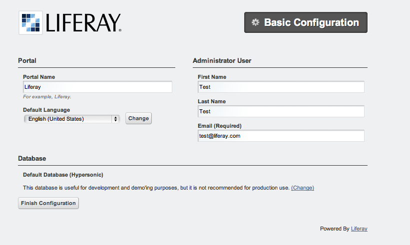

*************************************************************
Installation and configuration of the development environment
*************************************************************

**Liferay Bundle Installation**

* Download Liferay Bundle 6.1.1-ce-ga2 for Glassfish from `here <http://sourceforge.net/projects/lportal/files/Liferay%20Portal/6.1.1%20GA2/liferay-portal-glassfish-6.1.1-ce-ga2-20120731132656558.zip/download>`_

* Unzip the Liferay Bundle in the folder you prefer.

* set the LIFERAY_HOME env variable to the folder containg your Liferay Bundle:

::

	export LIFERAY_HOME=/Users/Macbook/Downloads/liferay-portal-6.1.1-ce-ga2

* set the executable permission to all binary file in glassfish bin folder:

::

	chmod +x glassfish-3.1.2/bin/*

* start the domain using the following command:

::

	$LIFERAY_HOME/glassfish-3.1.2/bin/asadmin start-domain domain1

You should have an output like the following:

::

	-----------------------------------------------------------------------------------------------------
	RicMac:bin Macbook$ $LIFERAY_HOME/glassfish-3.1.2/bin/asadmin start-domain domain1
	Waiting for domain1 to start ......
	Successfully started the domain : domain1
	domain  Location: 
        /Users/Macbook/Downloads/liferay-portal-6.1.1-ce-ga2/glassfish-3.1.2/domains/domain1
	Log File: 
        /Users/Macbook/Downloads/liferay-portal-6.1.1-ce-ga2/glassfish-3.1.2/domains/domain1/logs/server.log
	Admin Port: 4848
	Command start-domain executed successfully.
	----------------------------------------------------------------------------------------------------

* Open a browser window to http://localhost:8080/ This procedure will take a while during the first connection. At the end you should get the following interface:

* Press the 'Finish Configuration' button; it generates the portal' configuration file: 

	/Users/Macbook/Downloads/liferay-portal-6.1.1-ce-ga2/portal-setup-wizard.properties

* Press the 'Go My Portal' button, agree the conditions, set the new password and password retrival questions. 
	
	After then you'll be redirected to the Liferay home page.

* To check the Liferay log file:

::

	tail -f $LIFERAY_HOME/glassfish-3.1.2/domains/domain1/logs/server.log

* References:  `Official instructions (the example is for Tomcat only) <http://www.liferay.com/web/guest/community/wiki/-/wiki/Main/Quick%20Installation%20Instructions>`_

**MySQL - Installation and Configuration**

In case you have alreadya MySQL server in your system, you can skip this step just verifying that your version is 
< 5.6 due to an incompatibility issue between newer MySQL versions and the jdbc-connector.jar library provided with the current version of Liferay bundle.

* Install `MySQL <http://dev.mysql.com/downloads/>`_ (MySQL Community Server). 

You could skip the subscription to the ORACLE Web Login.

**DB_MACOSX:**

Instructions are available inside the README.txt file.

Select the DMG file and execute the two pkgs icons from the terminal.app execute: 

::

	sudo /Library/StartupItems/MySQLCOM/MySQLCOM start
	(your password will be requested)

Add the PATH to the .profile:

::

	export PATH=$PATH:/usr/local/mysql/bin

Start the service

::

	RicMac:liferay-portal-6.1.1-ce-ga2 Macbook$ sudo /Library/StartupItems/MySQLCOM/MySQLCOM start
	Password:
	Starting MySQL database server

**DB_LINUX:**

On L5/6 it is possible to install MySQL with:

::

	yum install mysql-server

Then the follow commands will enable mysql to start at boot and startup the mysql daemon process

::

	# chkconfig mysqld on
	# /etc/init.d/mysqld start

* generate the portal-ext.properties file:

::

	cat <<EOF > $LIFERAY_HOME/portal-ext.properties
	jdbc.default.driverClassName=com.mysql.jdbc.Driver
	jdbc.default.url=jdbc:mysql://localhost/lportal?useUnicode=true&characterEncoding=UTF-8&useFastDateParsing=false
	jdbc.default.username=liferayadmin
	jdbc.default.password=liferayadmin
	EOF

* create Liferay database

::

	mysql -u root
	CREATE USER 'liferayadmin' IDENTIFIED BY 'liferayadmin';
	CREATE DATABASE lportal;
	GRANT ALL PRIVILEGES ON lportal.* TO 'liferayadmin'@'localhost' IDENTIFIED BY 'liferayadmin';

* Download the mysql-connector from `here <http://sourceforge.net/projects/ctsciencegtwys/files/catania-grid-engine/1.4.21/mysql-connector-java-5.1.13.jar/download >`_  and copy it in $LIFERAY_HOME/glassfish-3.1.2/domains/domain1/lib/

*! Restart Liferay; this will cause Liferay to identify the DB and create new tables and data.

::

	$LIFERAY_HOME/glassfish-3.1.2/bin/asadmin stop-domain domain1 && \
	$LIFERAY_HOME/glassfish-3.1.2/bin/asadmin start-domain domain1

**Liferay Plugins SDK**

* Download the SDK from `here <http://www.liferay.com/downloads/liferay-portal/additional-files>`_ (Liferay Plugins SDK 6.1 GA 2).

	You may try clicking `here <https://downloads.sourceforge.net/project/lportal/Liferay%20Portal/6.1.1%20GA2/liferay-plugins-sdk-6.1.1-ce-ga2-20120731132656558.zip?r=http%3A%2F%2Fwww.liferay.com%2Fdownloads%2Fliferay-portal%2Fadditional-files&ts=1369692338&use_mirror=netcologne>`_

* Open the file LIFERAY_SDK_HOME/build.properties, uncomment 'glassfish' settings and setup the proper file path values. Comment out the default enabled tomcat settings.

* Pay attention that in LIFERAY_SDK_HOME/build.properties there are also settings to specify which java compiler will be used by ant; in case of troubles try to setup properly the  'javac.compiler' option; for instance switchin to 'modern' value.

* Be sure your system has installed 'ant' and 'ecj' orherwise install them.

* A small test could be the use of:

::

	cd $LIFERAY_SDK_HOME/portlets/
	./create.sh hello-world "Hello-World"

Pay attention that the create.sh file normally does not have enabled the execution permission

::

	chmod +x ./create.sh

* This should create the 'hello-world' portlet folder.

* Enter in hello-world-portlet folder:

::

	cd  hello-world-portlet

* Excute deploy command

::

	ant deploy

*  Liferay log file should contain some lines like this:

	Successfully autodeployed :
 
::

	LIFERAY_HOME/glassfish-3.1.2/domains/domain1/autodeploy/hello-world-portlet.|#]

**Grid Engine**

::

	Stop Liferay
	$LIFERAY_HOME/glassfish-3.1.2/bin/asadmin stop-domain domain1

*To create the database and the tables; download from `here <http://sourceforge.net/projects/ctsciencegtwys/files/catania-grid-engine/1.5.9/Database/UsersTrackingDB.sql/download>`_   the UsersTrackingDB.sql file and execute:

::

	mysql -u root < UsersTrackingDB/UsersTrackingDB.sql

In case the users tracking database already exists, uncomment the line:

::

	-- drop database userstracking;

Pay attention the line above will destroy the existing database.

* Download Grid Engine and JSAGA libraries from sourceforge and copy them in temporary folder:

::

	#
	# Use curl <namefile> > <namefile> in case you do not have wget
	#
	wget http://sourceforge.net/projects/ctsciencegtwys/files/catania-grid-engine/1.5.9/Liferay6.1/GridEngine_v1.5.9.zip/download

* Unzip the GridEngine_v1.5.9.zip inside the temporary folder:

::

	unzip GridEngine_v1.5.9.zip

* Move the config file from the temporary folder to the Liferay config folder:

::

	mv <temp folder path>/GridEngine_v1.5.9/GridEngineLogConfig.xml $LIFERAY_HOME/glassfish-3.1.2/domains/domain1/config

* Move all the other files to the Liferay lib folder

::

	mv <temp folder path>/GridEngine_v1.5.9/* $LIFERAY_HOME/glassfish-3.1.2/domains/domain1/lib

* Startup liferay

:

	$LIFERAY_HOME/glassfish-3.1.2/bin/asadmin start-domain domain1

* If you are using a virtual machine, be aware that Glassfish control panel access normally is forbidden from remote. Following commands are necessary to enable it:

::

	$LIFERAY_HOME/glassfish-3.1.2/bin/asadmin --host localhost --port 4848 change-admin-password
	$LIFERAY_HOME/glassfish-3.1.2/bin/asadmin enable-secure-admin

Please refer to the `Glassfish Administration Guide <http://docs.oracle.com/cd/E18930_01/html/821-2416/giubb.html>`_ for more details

**EUGRIDPMA and VOMSDIR**

Each access to any distributed infrastructure requires well defined authentication and authorization mechanisms. 

Most of Grid infrastructures are making use of the `GSI <http://en.wikipedia.org/wiki/Grid_Security_Infrastructure>`_. This security mechanism relies on X509 digital certificates provided by entities named Certification Authorities which themselves are using X509 certificates.

The CAs are normally registered by the `IGTF <http://www.igtf.net>`_ a body to establish common policies and guidelines between its Policy Management Authorities (PMAs). The CAs act as an independent trusted third party for both subscribers and relying parties within the infrastructure.

In order to setup CA certificates, it is necessary to perform one of the following instructions. RPM based Linux distributions may try the first approach (Linux systems); the othe platforms must use the second approach (Other systems).

* Linux systems

On linux systems it is possible to install the IGTF CA certificates executing the following steps:

* Other systems (MacOSx):

 Execute the following instructions to create the /etc/grid-security/certificates and /etc/grid-security/vomsdir folders:

::

	sudo mkdir -p /etc/grid-security
	curl http://grid.ct.infn.it/cron_files/grid_settings.tar.gz > grid_settings.tar.gz
	sudo tar xvfz grid_settings.tar.gz -C /etc/grid-security/

(!)  Archives below will expire timely so that they should be kept updated

(!!) vomsdir must be updated with VO you are going to support

**VPN Setup to get the access to the eTokenserver**

The eToken server is the responsible to deliver grid proxy certificate to the GridEngine starting form Robot Certificates stored into an eToken USB key.

For security purposes is not possible to access directly the eTokenServer. For porltet developers it is possible to open a VPN connection.

In order to get the necessary certificates you have to send us a

[[mailto:sg-licence@ct.infn.it?subject=Request eTokenserver VPN account&body=Please provide me access to the eTokenserver VPN|request]]

The VPN connection information will be released in OpenVPN format, together with the necessary certificate and a password.

For Mac users we may suggest `Tunnelblick for MacOSX platforms <http://code.google.com/p/tunnelblick/>`_.

There is also this `video <http://youtu.be/z2U1-5y0Q8I>`_ showing how to setup the VPN from the configuration files sent by us.
For other platforms like Linux we suggest to install  `OpenVPN <http://openvpn.net>`_ client and then execute from the same directory holding the certificate:

::

	openvpn --config <received_conf_file>.ovpn

Please notice that on CentOS7 VPN will not work by default since provided VPN certificates are encrypted using MD5 and SHA1 which are no longer supported on CentOS 7. To be able to use the VPN certificate anyway it is possible to enable Md5 support on CentOS7; just executing as root:

::

	cat >> /usr/lib/systemd/system/NetworkManager.service <<EOF
	[Service]
	Environment="OPENSSL_ENABLE_MD5_VERIFY=1 NSS_HASH_ALG_SUPPORT=+MD5"
	EOF
	systemctl daemon-reload
	systemctl restart NetworkManager.service

Further details about this issue are available `here <http://software-engineer.gatsbylee.com/centos7openvpn-verify-error-depth0-errorcertificate-signature-failure/>`_  (Thanks to `Manuel Rodriguez Pascual <mailto:manuel.rodriguez.pascual@gmail.com>`_)

**Development**

**WARNING**

For architectural reasons the constructor of GridEngine object must be declared differently than the portlet code written for the production environment

**The constructor must be created with:**

::

	MultiInfrastructureJobSubmission multiInfrastructureJobSubmission = new MultiInfrastructureJobSubmission
        ("jdbc:mysql://localhost/userstracking","tracking_user","usertracking");

In the portlet examples the constructor call lies inside the *submitJob* method

**Integrated Development Environment (IDE)**

We recommend `NetBeans <https://netbeans.org>`_ as IDE to develop portlets and other Liferay plugins.
In order to create Liferay plugins you can use the `Plugin Portal Pack <https://contrib.netbeans.org/portalpack/>`_ extension of NetBeans or configure the plugin to use the Liferay SDK

**References**

`Liferay Plugin SDK - How to http://www.liferay.com/it/community/wiki/-/wiki/Main/Plugins+SDK`_

`Plugin Guide  http://www.scribd.com/doc/8533275/Liferay-43-Plugins-Guide`_
